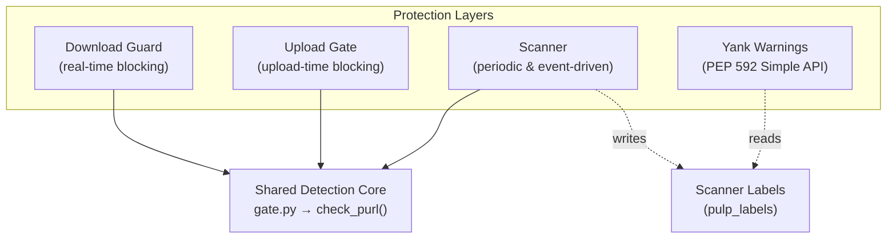

<p align="center">
  <br/>
  <a href="https://github.com/otaviof/pulp_trustify/actions/workflows/ci.yml"></a>
  <a href="https://github.com/otaviof/pulp_trustify/actions/workflows/release.yml"></a>
  <a href="https://github.com/otaviof/pulp_trustify/actions/workflows/e2e.yml"></a>
</p>

# `pulp_trustify`

Pulp plugin integrating [Trustify](https://github.com/guacsec/trustify) CVE intelligence for vulnerability-gated artifact serving. [Trustify](https://docs.guac.sh/trustify/) is a [GUAC](https://guac.sh/) project that ingests SBOMs and security advisories to identify vulnerable software components.

## Architecture Overview

Four complementary protection layers cover the full artifact lifecycle. **Guard** and **Upload Gate** are reactive (per-request blocking). **Scanner** is proactive (repository-wide sweep). **Yank Warnings** are advisory (inline pip warnings). Together they provide complete coverage:

- **Past**: [Scanner](docs/scanner.md) finds packages already in the repository that have had CVEs disclosed since they were uploaded
- **Present**: [Download Guard](docs/guard.md) blocks downloads of vulnerable packages right now
- **Future**: [Upload Gate](docs/upload-gate.md) prevents new vulnerable packages from entering
- **Awareness**: [Yank Warnings](docs/yank.md) surface CVE details in pip's output before the hard block

All four layers share the same detection core (`gate.py`) and severity threshold.



## Quick Start

Configure the [`pulp` CLI](https://docs.pulpproject.org/pulp_cli/):

```bash
pulp config create \
    --base-url https://pulp.example.com \
    --api-root /pulp/ \
    --username admin \
    --password <password>
```

Verify the plugin is installed:

```bash
pulp status | python3 -c "import sys,json; \
  [print(v['component'], v['version']) \
  for v in json.load(sys.stdin)['versions'] \
  if v['component']=='trustify']"
```

Create and attach a download guard:

```bash
# Create a TrustifyGuard (no CLI subcommand — use curl)
curl -X POST https://pulp.example.com/api/v3/contentguards/trustify/guard/ \
  -u admin:<password> -H "Content-Type: application/json" \
  -d '{"name": "trustify-guard"}'

# Attach to a distribution
pulp python distribution update \
  --name local-pypi \
  --content-guard /api/v3/contentguards/trustify/guard/<guard-uuid>/

# Verify: download a vulnerable package (should return 403)
curl -o /dev/null -w "%{http_code}" \
  https://pulp.example.com/pulp/content/local-pypi/urllib3-2.6.2-py3-none-any.whl
```

Configure via `PULP_TRUSTIFY_*` env vars on the Pulp pods. See [Settings Reference](docs/settings.md).

## Documentation

| Document | Description |
|:---------|:------------|
| [docs/architecture.md](docs/architecture.md) | Protection layers, PURL extraction, authentication |
| [docs/detection.md](docs/detection.md) | Detection pipeline, analyze + search fallback, severity filtering |
| [docs/guard.md](docs/guard.md) | Download guard deep-dive |
| [docs/upload-gate.md](docs/upload-gate.md) | Upload gate deep-dive |
| [docs/scanner.md](docs/scanner.md) | Scanner and actions deep-dive |
| [docs/yank.md](docs/yank.md) | PEP 592 yank warnings deep-dive |
| [docs/settings.md](docs/settings.md) | Full configuration reference and observability |
| [docs/known-limitations.md](docs/known-limitations.md) | All caveats and constraints |
| [deploy/README.md](deploy/README.md) | Deployment guide |
| [CONTRIBUTING.md](CONTRIBUTING.md) | Development setup and guidelines |

## Key Settings

| Setting | Default | Description |
|:--------|:--------|:------------|
| `TRUSTIFY_URL` | `""` | Trustify API base URL |
| `TRUSTIFY_SEVERITY_THRESHOLD` | `"critical"` | Minimum severity to block |
| `TRUSTIFY_FAIL_OPEN` | `False` | Allow operations when Trustify is unreachable |
| `TRUSTIFY_GATE_UPLOADS` | `True` | Enable upload-time vulnerability checks |

See [docs/settings.md](docs/settings.md) for all 19 settings.

## Development

See [CONTRIBUTING.md](CONTRIBUTING.md) for development setup, code style, testing, and pull request guidelines.

## Deployment

The plugin ships as a container image extending `pulp/pulp-minimal`, published to `ghcr.io/otaviof/pulp_trustify`. CI pushes the `main` tag on every merge; releases tag the image with the plugin version. Point your Pulp deployment at the image and set `PULP_TRUSTIFY_*` environment variables on the api, content, and worker pods.

See [deploy/README.md](deploy/README.md) for a deployment script example, environment variables, and Kubernetes setup.
