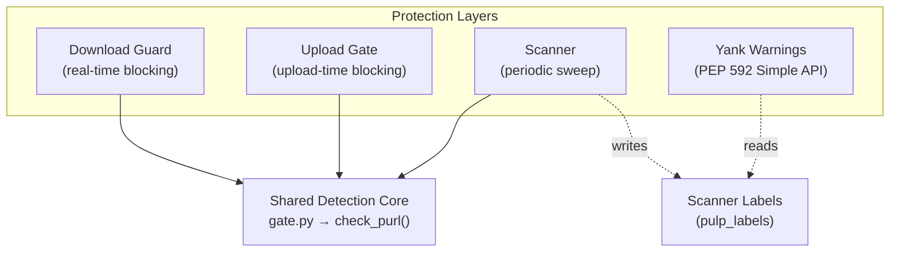

# `pulp_trustify`

[](https://github.com/otaviof/pulp_trustify/actions/workflows/ci.yml) [](https://github.com/otaviof/pulp_trustify/actions/workflows/release.yml) [](https://github.com/otaviof/pulp_trustify/actions/workflows/e2e.yml)

Pulp plugin integrating [Trustify](https://github.com/guacsec/trustify) CVE intelligence for vulnerability-gated artifact serving. [Trustify](https://docs.guac.sh/trustify/) is a [GUAC](https://guac.sh/) project that ingests SBOMs and security advisories to identify vulnerable software components.

## Architecture Overview

Four complementary protection layers, all powered by a shared detection core (`gate.py`):

1. **[Download Guard](docs/guard.md)** — Blocks vulnerable artifact downloads at the content app level (403)
2. **[Upload Gate](docs/upload-gate.md)** — Rejects vulnerable uploads at ingestion time via Django signals (400)
3. **[Scanner](docs/scanner.md)** — Batch-scans existing content with configurable actions: label, quarantine, remove, advisory
4. **[Yank Warnings](docs/yank.md)** — Injects PEP 592 `data-yanked` into Simple API responses for vulnerable packages



## Quick Start

```bash
# 1. Create a TrustifyGuard (no CLI subcommand — use curl)
curl -X POST https://pulp.example.com/api/v3/contentguards/trustify/guard/ \
  -u admin:<password> -H "Content-Type: application/json" \
  -d '{"name": "trustify-guard"}'

# 2. Attach to a distribution
pulp python distribution update \
  --name local-pypi \
  --content-guard /api/v3/contentguards/trustify/guard/<guard-uuid>/

# 3. Verify: download a vulnerable package (should return 403)
curl -o /dev/null -w "%{http_code}" \
  https://pulp.example.com/pulp/content/local-pypi/urllib3-2.6.2-py3-none-any.whl
```

Configure via `PULP_TRUSTIFY_*` env vars on the Pulp pods. See [Settings Reference](docs/settings.md).

## Documentation

| Document | Description |
|:---------|:------------|
| [docs/architecture.md](docs/architecture.md) | Protection layers, PURL extraction, authentication |
| [docs/detection.md](docs/detection.md) | Detection pipeline, analyze + search fallback, severity filtering |
| [docs/guard.md](docs/guard.md) | Download guard deep-dive |
| [docs/upload-gate.md](docs/upload-gate.md) | Upload gate deep-dive |
| [docs/scanner.md](docs/scanner.md) | Scanner and actions deep-dive |
| [docs/yank.md](docs/yank.md) | PEP 592 yank warnings deep-dive |
| [docs/settings.md](docs/settings.md) | Full configuration reference and observability |
| [docs/known-limitations.md](docs/known-limitations.md) | All caveats and constraints |
| [deploy/README.md](deploy/README.md) | Deployment guide |
| [CONTRIBUTING.md](CONTRIBUTING.md) | Development setup and guidelines |

## Key Settings

| Setting | Default | Description |
|:--------|:--------|:------------|
| `TRUSTIFY_URL` | `""` | Trustify API base URL |
| `TRUSTIFY_SEVERITY_THRESHOLD` | `"critical"` | Minimum severity to block |
| `TRUSTIFY_FAIL_OPEN` | `False` | Allow operations when Trustify is unreachable |
| `TRUSTIFY_GATE_UPLOADS` | `True` | Enable upload-time vulnerability checks |

See [docs/settings.md](docs/settings.md) for all 19 settings.

## Development

See [CONTRIBUTING.md](CONTRIBUTING.md) for development setup, code style, testing, and pull request guidelines.

## Deployment

See [deploy/README.md](deploy/README.md) for environment variables, script flags, and Kubernetes deployment.
