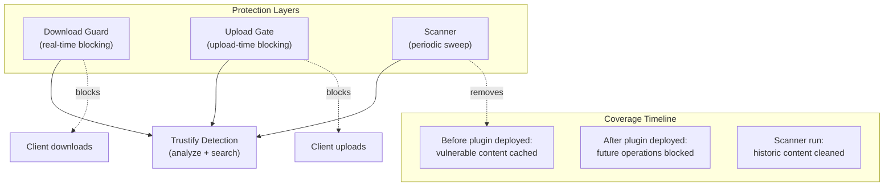
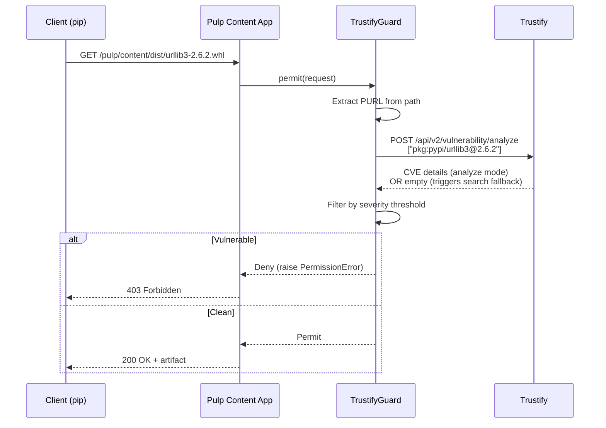
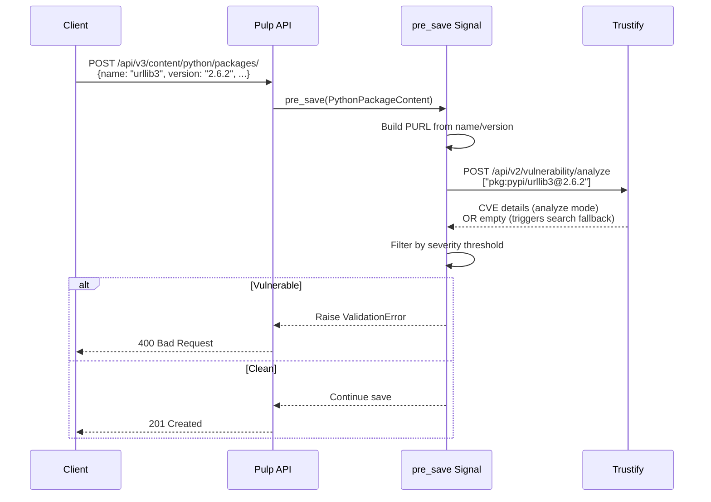
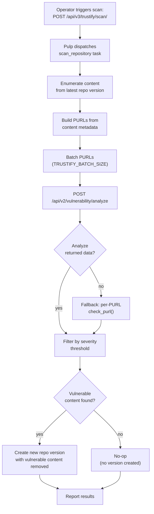

# `pulp_trustify`

Pulp plugin integrating [Trustify](https://trustify.dev/) CVE intelligence for vulnerability-gated artifact serving. The plugin provides three complementary protection mechanisms:

1. **Download Guard**: A `ContentGuard` that blocks downloads of vulnerable packages
2. **Upload Gate**: A pre-save signal handler that blocks uploads of vulnerable packages
3. **Scanner**: A dispatched task that removes vulnerable artifacts from existing repositories

All three use the same dual-mode detection (analyze + search fallback) and share the severity threshold configuration.

## Architecture Overview



**Guard** and **Upload Gate** are reactive (per-request blocking). **Scanner** is proactive (repository-wide sweep). Together they provide complete coverage:

- **Past:** Scanner cleans up content cached before the plugin was deployed
- **Present:** Guard blocks downloads of vulnerable packages right now
- **Future:** Upload Gate prevents new vulnerable packages from entering

All three mechanisms share the same detection logic and severity threshold.

## How It Works

### Download Guard



1. A client requests a package download (e.g., `pip install`)
2. Pulp's Content App invokes `TrustifyGuard.permit(request)`
3. The guard extracts a [Package URL](https://github.com/package-url/purl-spec)
   from the request path (currently supports PyPI wheels and sdists)
4. The guard queries Trustify in one of two modes (see Detection Modes
   below)
5. Vulnerabilities matching the severity threshold produce a
   `403 Forbidden`

### Upload Gate



1. A client uploads a Python package via the Pulp API
2. Django's `pre_save` signal fires before creating `PythonPackageContent`
3. The gate constructs a PURL from the package's `name` and `version` fields
4. The gate queries Trustify using the same dual-mode detection
5. Vulnerabilities matching the severity threshold produce a `400 Bad Request`

**Limitations**:

- Controlled by the `TRUSTIFY_GATE_UPLOADS` setting (default: `True`)
- Does not apply to packages imported via `pulp_python` sync tasks (uses `bulk_create()`, which bypasses Django signals)
- Adds latency to each upload (30s timeout per Trustify query)
- Requires `pulp_python` to be installed (gracefully disabled otherwise)

### Scanner



The Scanner is a Pulp dispatched task that proactively walks repository content and removes vulnerable artifacts by creating new immutable repository versions.

**When to use:**

- Clean up content cached **before** the plugin was deployed
- Remove packages whose CVE was disclosed **after** they were cached
- Periodic repository hygiene (automated via cron or operator schedules)

**How it works:**

1. Operator triggers scan via REST API (or dispatch directly)
2. Task enumerates all content in the repository's latest version
3. Builds PURLs from content metadata (name/version fields)
4. Queries Trustify in batches (default: 100 PURLs per API call)
5. Uses analyze mode first, falls back to search for packages without
   OSV data
6. Creates a new repository version **excluding** vulnerable artifacts
7. If no vulnerabilities found, completes without creating a version

**Key differences from Guard/Gate:**

- **Scope:** Entire repository vs. single request
- **Timing:** Periodic/on-demand vs. real-time
- **Action:** Removes artifacts vs. blocks access
- **Performance:** Batch API calls vs. per-request calls

The Scanner shares the exact same detection pipeline as the Guard
and Upload Gate (`check_purl()` → analyze + search fallback).

**Triggering a scan:**

```bash
curl -X POST https://pulp.example.com/api/v3/trustify/scan/ \
  -u admin:<password> \
  -H "Content-Type: application/json" \
  -d '{
    "repository": "/api/v3/repositories/python/python/<uuid>/"
  }'
```

Response:

```json
{
  "task": "/api/v3/tasks/018f-1234-5678-90ab/"
}
```

**Monitoring scan progress:**

```bash
# Poll the task
curl https://pulp.example.com/api/v3/tasks/018f-1234-5678-90ab/ \
  -u admin:<password>

# Check progress reports
curl https://pulp.example.com/api/v3/tasks/018f-1234-5678-90ab/ \
  -u admin:<password> | jq '.progress_reports'
```

Progress reports:

| Phase | Message | Indicates |
|:------|:--------|:----------|
| Scanning | `"Scanning content for vulnerabilities"` | Trustify queries in progress |
| Removing | `"Removing vulnerable content"` | New repository version being created |

**After scan completion:**

```bash
# View repository versions
curl https://pulp.example.com/api/v3/repositories/python/python/<uuid>/versions/ \
  -u admin:<password>

# Check removed content in the new version
curl https://pulp.example.com/api/v3/repositories/python/python/<uuid>/versions/<version-number>/removed_content/ \
  -u admin:<password>
```

**Limitations:**

- Currently supports PyPI packages only (extensible via PURL registry)
- Scans the entire latest version (no incremental scanning)
- Requires exclusive lock on repository (blocks concurrent syncs/scans)
- Controlled by `TRUSTIFY_SCAN_ENABLED` setting (default: `True`)

### Detection Modes

The guard operates in two modes, trying **analyze** first and falling
back to **search** when needed:

#### Analyze Mode (Preferred)

- Calls `POST /api/v2/vulnerability/analyze` with the package PURL
- Requires Trustify's OSV or CSAF importers to be enabled
- Server-side version matching with scheme-aware comparison
- For PyPI, requires the [PyPA Advisory Database](https://github.com/pypa/advisory-database)
  OSV importer

When OSV data is available, this is the most reliable detection method.

#### Search Fallback Mode

- Automatically triggered when `analyze` returns empty results
- Searches Trustify's vulnerability endpoint by package name
- Parses version ranges from CVE description text using regex
- Compares versions client-side using `packaging.version`

This mode enables vulnerability detection when only the CVE importer is active (no OSV data). It is best-effort: version range parsing is heuristic, and some CVE phrasings may not be recognized.

**The guard always tries analyze first.** The fallback is transparent: no configuration change is needed. When you enable the OSV importer, the guard automatically switches to analyze mode.

### Trustify Importer Requirements

The plugin's behavior depends on which importers are enabled on your Trustify instance:

| Importer | Detection Mode | Notes |
|:---------|:--------------|:------|
| **OSV** (advisory-database) | Analyze mode | Preferred. Server-side version matching. For PyPI, use the PyPA Advisory Database: `https://github.com/pypa/advisory-database` |
| **CVE** (cvelistV5) | Search fallback mode | Default in many deployments. Client-side version parsing from CVE description text. Best-effort heuristic. |
| **CSAF** (vendor advisories) | Analyze mode | Vendor-specific (e.g., Red Hat). Not applicable for PyPI. |
| **None** | Blocks or allows all | If no importers are active: `fail_open=True` allows all downloads, `fail_open=False` blocks all. |

To get full coverage for PyPI packages, enable the PyPI OSV importer in Trustify:

```json
{
  "osv": {
    "source": "https://github.com/pypa/advisory-database",
    "path": "vulns",
    "disabled": false,
    "period": "6h"
  }
}
```

The guard works immediately with only the CVE importer active (fallback mode), but analyze mode is more reliable once OSV data is ingested.

## Development

See [CONTRIBUTING.md](CONTRIBUTING.md) for development setup, code style, testing, and pull request guidelines.

## Deployment

The plugin ships as a container image extending `pulp/pulp-minimal`. Deploy with:

```bash
poe image-build
poe image-push
poe deploy
```

See [deploy/README.md](deploy/README.md) for environment variables, script flags, and troubleshooting.

## Settings Reference

| Setting | Default | Description |
|:--------|:--------|:------------|
| `TRUSTIFY_URL` | `""` | Trustify API base URL |
| `TRUSTIFY_API_VERSION` | `"v2"` | Trustify API version |
| `TRUSTIFY_CLIENT_ID` | `"cli"` | OIDC client ID |
| `TRUSTIFY_CLIENT_SECRET` | `""` | OIDC client secret |
| `TRUSTIFY_ISSUER_URL` | `""` | OIDC issuer URL (Keycloak realm) |
| `TRUSTIFY_CA_BUNDLE` | `""` | Path to CA certificate bundle |
| `TRUSTIFY_SEVERITY_THRESHOLD` | `"critical"` | Minimum severity to block (`low`, `medium`, `high`, `critical`) |
| `TRUSTIFY_FAIL_OPEN` | `False` | If `True`, allow downloads/uploads when Trustify API calls fail (applies to both analyze and search fallback modes) |
| `TRUSTIFY_GATE_UPLOADS` | `True` | If `False`, disable upload-time vulnerability checks (download guard still applies) |
| `TRUSTIFY_SCAN_ENABLED` | `True` | If `False`, disable the scan API endpoint |
| `TRUSTIFY_BATCH_SIZE` | `100` | Number of PURLs per batch analyze call (scanner only) |
| `TRUSTIFY_LOG_LEVEL` | `"INFO"` | Log verbosity for the plugin (`DEBUG`, `INFO`, `WARNING`, `ERROR`, `CRITICAL`) |

All settings are read via Dynaconf. Set them as `PULP_TRUSTIFY_*` env vars on the Pulp pods.

**Note:** The guard automatically chooses the detection mode based on Trustify's data. No configuration change is needed to switch between analyze and search fallback modes.

## Usage

### Create and Attach the Download Guard

The upload gate activates automatically. The download guard requires explicit attachment to a distribution:

```bash
# Create a TrustifyGuard instance
curl -X POST https://pulp.example.com/api/v3/contentguards/trustify/guard/ \
  -u admin:<password> -H "Content-Type: application/json" \
  -d '{"name": "trustify-guard"}'

# Attach the guard to a distribution
curl -X PATCH https://pulp.example.com/api/v3/distributions/python/pypi/<uuid>/ \
  -u admin:<password> -H "Content-Type: application/json" \
  -d '{"content_guard": "/api/v3/contentguards/trustify/guard/<guard-uuid>/"}'
```

### Verify

```bash
# Plugin appears in Pulp status
curl -s https://pulp.example.com/api/v3/status/ | \
  python3 -c "import sys,json; [print(v['component'], v['version']) \
  for v in json.load(sys.stdin)['versions'] \
  if v['component']=='trustify']"

# Test upload gate: upload a vulnerable package (should return 400)
curl -X POST https://pulp.example.com/api/v3/content/python/packages/ \
  -u admin:<password> \
  -F "name=urllib3" \
  -F "version=2.6.2" \
  -F "file=@urllib3-2.6.2-py3-none-any.whl"

# Test download guard: download a vulnerable package (should return 403)
# Works in both analyze mode (with OSV) and search fallback mode
# (CVE-only)
curl -o /dev/null -w "%{http_code}" \
  https://pulp.example.com/pulp/content/<dist>/urllib3-2.6.2-py3-none-any.whl

# Download a fixed package (should return 200)
curl -o /dev/null -w "%{http_code}" \
  https://pulp.example.com/pulp/content/<dist>/urllib3-2.7.0-py3-none-any.whl

# Test scanner: trigger a repository scan
curl -X POST https://pulp.example.com/api/v3/trustify/scan/ \
  -u admin:<password> \
  -H "Content-Type: application/json" \
  -d '{"repository": "/api/v3/repositories/python/python/<uuid>/"}'
# Expected: 202 Accepted with task href

# Monitor the scan task
curl https://pulp.example.com/api/v3/tasks/<task-uuid>/ \
  -u admin:<password> | jq '.state, .progress_reports'
# Expected: state="completed", progress shows scanning phases

# Verify new repository version was created (if vulnerable content found)
curl https://pulp.example.com/api/v3/repositories/python/python/<uuid>/versions/ \
  -u admin:<password> | jq '.results[0] | {number, removed_count}'
```

#### Verify Detection Mode

Check which mode the guard is using by examining Trustify's data:

```bash
# Check if OSV data is available (analyze mode indicator)
curl -X POST https://trustify.example.com/api/v2/vulnerability/analyze \
  -H "Authorization: Bearer $TOKEN" \
  -H "Content-Type: application/json" \
  -d '{"purls": ["pkg:pypi/urllib3@2.6.2"]}'

# If analyze returns CVE details -> analyze mode active
# If analyze returns {} -> search fallback mode active
```

## Logging and Observability

The plugin emits structured logs through Python's standard
`logging` module, using pulpcore's existing `console` handler
and `simple` formatter with correlation IDs. No custom handlers
or formatters are introduced.

### Configuration

Control log verbosity via the `TRUSTIFY_LOG_LEVEL` setting:

```bash
# Environment variable (recommended for containers)
PULP_TRUSTIFY_LOG_LEVEL=DEBUG

# Settings file (/etc/pulp/settings.py)
TRUSTIFY_LOG_LEVEL = "DEBUG"
```

Valid levels: `DEBUG`, `INFO`, `WARNING`, `ERROR`, `CRITICAL`
(default: `INFO`).

### Log Content by Level

| Level | What is logged |
|:------|:---------------|
| `DEBUG` | PURL resolution, batch boundaries, API endpoints called, OIDC token refresh, analyze vs. search fallback decisions, parser registration |
| `INFO` | Scan started/completed, content blocked (with CVE IDs), guard decisions, task dispatch, client initialization, plugin startup |
| `WARNING` | Fail-open events (Trustify API unreachable), upload rejections, OIDC token fetch failures, API request errors |

### Debug a Blocked Download

```bash
# Enable debug logging on the content app
kubectl set env deployment/pulp-content -n pulp \
  PULP_TRUSTIFY_LOG_LEVEL=DEBUG

# Check logs after triggering a download
kubectl logs -n pulp deployment/pulp-content \
  | grep pulp_trustify
```

Expected output at DEBUG level:

```
pulp_trustify.guard: Guard checking path: ...
pulp_trustify.guard: Resolved PURL: pkg:pypi/urllib3@2.6.2
pulp_trustify.client.client: POST .../analyze with 1 PURLs
pulp_trustify.gate: PURL pkg:pypi/urllib3@2.6.2 has 2 CVEs ...
pulp_trustify.gate: Blocking pkg:pypi/urllib3@2.6.2: CVE-...
```

### Monitor a Scan Task

```bash
# Scan logs appear in worker logs
kubectl logs -n pulp deployment/pulp-worker \
  | grep pulp_trustify
```

Expected progression:

```
pulp_trustify...scanner: Scan task started for repository <uuid>
pulp_trustify...scanner: Scanning content for vulnerabilities
pulp_trustify.scanner: Processing batch 1/5 (100 PURLs)
pulp_trustify...scanner: removing 3 vulnerable items
```
