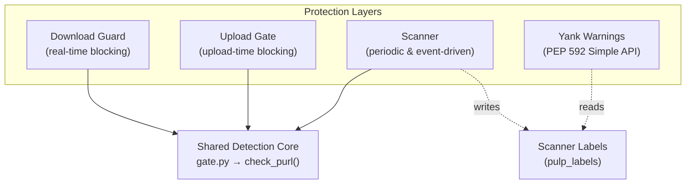

# Architecture

`pulp_trustify` is a `pulpcore` plugin — a Django app discovered at runtime via the `pulpcore.plugin` entry point. It provides four protection layers that share a common detection core.

## Protection Layers

| Layer | Timing | Action | Scope |
|:------|:-------|:-------|:------|
| [Download Guard](guard.md) | Per-request | Blocks download (403) | Single artifact |
| [Upload Gate](upload-gate.md) | Per-upload | Rejects upload (400) | Single package |
| [Scanner](scanner.md) | On-demand / periodic / event-driven | Label, quarantine, remove, advisory | Entire repository |
| [Yank Warnings](yank.md) | Per-index-request | Injects PEP 592 `data-yanked` | Simple API response |

### Temporal Coverage

Each protection layer checks Trustify at a different point in the artifact lifecycle, with different data freshness guarantees and failure modes.

| Layer | Checks at | Data freshness | Behavior on vulnerability |
|:------|:----------|:---------------|:--------------------------|
| Download Guard | Download time | Freshest (real-time) | Blocks download (403) |
| Upload Gate | Sync/upload time | Point-in-time | Fails entire sync |
| Event-Driven Scanner | Post-sync (async) | Same as gate | Selective removal |
| Periodic Scanner | Scheduled interval | As recent as last run | Selective removal |
| Yank Warnings | Index request time | Scanner labels | Advisory only |

The upload gate and event-driven scanner query the same Trustify data at approximately the same time, but they serve different operational modes. The gate provides all-or-nothing sync blocking (strict — no vulnerable content enters, but the entire sync fails if any package is vulnerable). Event-driven scanning provides selective remediation (permissive — syncs always succeed, vulnerable content is removed post-sync). Operators choose based on their tolerance for sync failures vs. temporary exposure windows covered by the download guard.

## PURL Extraction

The plugin uses a pluggable parser registry to convert URL paths or content objects into [Package URLs](https://github.com/package-url/purl-spec).

- **`@register('pypi')`** — `parse_pypi_url(path)`: extracts PURL from download paths (wheels, sdists). Used by the download guard via `url_to_purl()`.
- **`@register_content('pypi')`** — `parse_pypi_content(content)`: extracts PURL from content model fields (name, version). Used by the upload gate and scanner via `content_to_purl()`.

Currently supports PyPI packages only. Additional ecosystems can be added by decorating new parser functions.

## Authentication

`TrustifyClient` authenticates via OIDC `client_credentials` grant against a Keycloak realm. Tokens are cached with a 30-second expiry buffer and refreshed lazily under a `threading.Lock`. Custom CA bundles are supported via `TRUSTIFY_CA_BUNDLE`.

See [Settings Reference](settings.md#connection) for `TRUSTIFY_ISSUER_URL`, `TRUSTIFY_CLIENT_ID`, and `TRUSTIFY_CLIENT_SECRET`. See [Trustify Concepts](https://docs.guac.sh/trustify/concepts/) for the upstream authentication model.

## Detection Pipeline

All protection layers share the same detection logic — see [Detection Pipeline](detection.md) for the full analysis, including the dual-mode detection flow (analyze + search fallback), severity filtering, fail-open behavior, and Trustify importer requirements.
