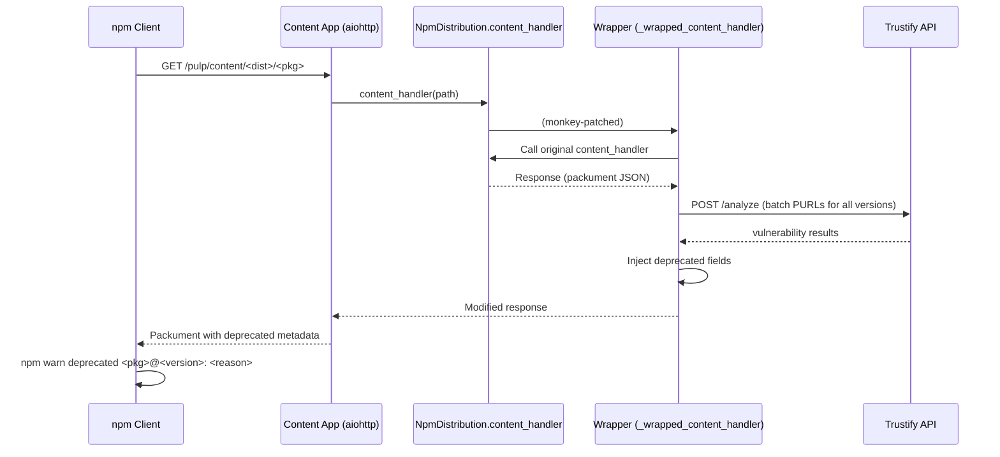
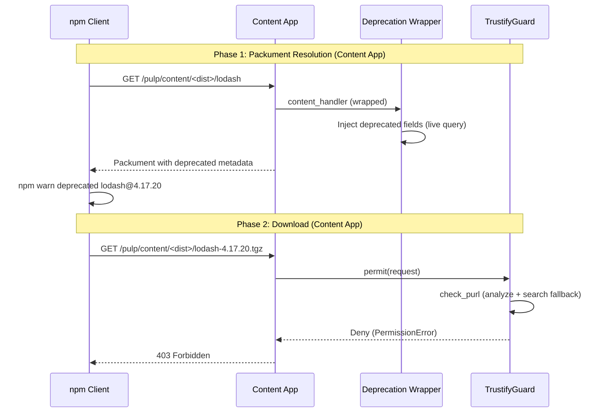

# NPM Deprecation Warnings

Monkey-patch wrapper for `pulp_npm.app.models.NpmDistribution.content_handler` that injects `deprecated` fields into NPM packument JSON responses for versions marked vulnerable by the scanner or detected via live Trustify queries. NPM clients (`npm`, `yarn`, `pnpm`) display inline warnings before installation.

NPM deprecation is advisory — for enforcement, use the [Download Guard](guard.md).

## How It Works

When a client queries the NPM registry for package metadata (e.g., `npm view <pkg>`), the wrapper intercepts the packument response from `NpmDistribution.content_handler` and injects `deprecated` fields for vulnerable versions by querying Trustify live, with scanner labels as fallback.



### Guard Checks

The wrapper skips processing when any of these conditions is false:

1. `pulp_npm` is installed
2. `TRUSTIFY_DEPRECATE_VULNERABLE` is enabled (default: `True`)
3. Response body is not empty
4. Content-Type is `application/json`
5. Packument has a `versions` object

All checks are fail-safe: any exception during injection is caught, logged at `ERROR` level, and the original response is returned unmodified. The wrapper never blocks a packument response, it only adds metadata.

## How NPM Deprecation Works

NPM's registry protocol includes a `deprecated` field in packument version objects. When present, NPM clients display the deprecation message as a warning during installation. The warning is advisory — clients still allow installation of deprecated versions.

`pulp_trustify` uses this mechanism to surface vulnerability information directly in the package manager workflow. The scanner labels vulnerable packages, and the wrapper translates those labels into `deprecated` fields with Trustify CVE URLs as the reason.

## npm CLI

```
$ npm install lodash@4.17.20
npm warn deprecated lodash@4.17.20: Vulnerable package flagged by Trustify:
- https://trustify.example.com/vulnerabilities/CVE-2024-1234
- https://trustify.example.com/vulnerabilities/CVE-2024-5678
- https://trustify.example.com/vulnerabilities/CVE-2024-9012
```

`TRUSTIFY_YANK_MAX_CVES` (default: 3) limits the number of CVE URLs in the reason string. This setting is shared with [Yank Warnings](yank.md).

## Pulp CLI

Check whether deprecation metadata is present in the packument response:

```bash
# Query packument directly (Content App URL)
curl -sSk 'https://pulp.example.com/pulp/content/my-npm-repo/lodash'

# Look for "deprecated" field in version objects
curl -sSk 'https://pulp.example.com/pulp/content/my-npm-repo/lodash' \
  | jq '.versions["4.17.20"].deprecated'
```

Expected output:

```
"Vulnerable package flagged by Trustify:\n- https://trustify.example.com/vulnerabilities/CVE-2024-1234\n- https://trustify.example.com/vulnerabilities/CVE-2024-5678\n- https://trustify.example.com/vulnerabilities/CVE-2024-9012"
```

## Content App vs API App

NPM deprecation **only works with the Content App URL**. The wrapper patches `NpmDistribution.content_handler`, which runs in the Pulp Content App (aiohttp), not in Django's request/response cycle.

This is the **opposite** of [Yank Warnings](yank.md), which only work with the API App URL. The difference is architectural: PyPI Simple API responses are served by Django, while NPM packuments are served by the Content App's async handler.

```bash
# Correct (Content App — packument responses, deprecation active)
npm install --registry https://pulp.example.com/pulp/content/my-npm-repo/ lodash

# Wrong (if using API app URL — no packument responses here)
# NPM does not use the API app for registry operations
```

## Interaction with Download Guard

When both NPM deprecation and download guard are active, they form a two-phase flow:



The warning gives context **before** the hard block.

See [Known Limitations — NPM Deprecation](known-limitations.md#npm-deprecation) for caveats.
