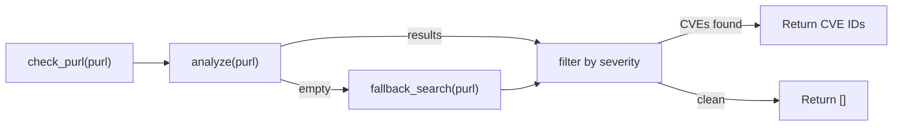

# Detection Pipeline

How `pulp_trustify` queries [Trustify](https://github.com/guacsec/trustify) to determine whether a package is vulnerable. All four protection layers share this logic via `gate.py:check_purl()`.

See [Trustify Vulnerability Correlation Overview](https://docs.guac.sh/trustify/vulnerability-correlation-overview/) for how Trustify correlates advisories to packages upstream.

## Dual-Mode Detection

The plugin tries the **analyze** endpoint first and falls back to **search** when analyze returns empty results:

No configuration change is needed to switch between modes — the fallback is transparent.

### Analyze Mode (Preferred)

- Calls `POST /api/{version}/vulnerability/analyze` with the package PURL
- Server-side version matching with scheme-aware comparison
- Requires Trustify's OSV or CSAF importers to have ingested advisory data
- For PyPI, requires the [PyPA Advisory Database](https://github.com/pypa/advisory-database) OSV importer

### Search Fallback Mode

Automatically triggered when analyze returns empty results. Searches Trustify by package name, then performs client-side version matching.

The `fallback_search()` function:

1. Extracts package name and version from the PURL
2. Queries `GET /api/{version}/vulnerability?q={name}`
3. Parses version ranges from CVE description text using four regex patterns
4. Compares versions client-side using PEP 440 (`packaging.version.Version`)
5. Filters results by severity threshold

**Version range patterns** recognized by `version.py`:

| Pattern | Example Text |
|:--------|:-------------|
| `_RANGE_PATTERN` | "Starting in version 1.22 and prior to version 2.6.3" |
| `_FROM_PATTERN` | "From 1.23 to before 2.7.0" |
| `_THROUGH_PATTERN` | "versions 1.0 through 2.0" |
| `_BEFORE_PATTERN` | "prior to version 2.6.3" |

This mode is best-effort: version range parsing is heuristic, and some CVE phrasings may not be recognized.

## Severity Filtering

`policy.py` defines the severity scale used by all protection layers:

| Level | Numeric Value |
|:------|:-------------|
| `low` | 0 |
| `medium` | 1 |
| `high` | 2 |
| `critical` | 3 |

`filter_vulnerabilities(details, threshold)` keeps entries whose severity is at or above the threshold. The threshold is configured via `TRUSTIFY_SEVERITY_THRESHOLD` (default: `"critical"`). See [Settings Reference](settings.md).

## Fail-Open Behavior

When Trustify is unreachable:

- `TRUSTIFY_FAIL_OPEN=True` — log a warning, allow the operation
- `TRUSTIFY_FAIL_OPEN=False` (default) — raise `PermissionError`, block the operation

This applies to both analyze and search fallback modes.

## Trustify Importer Requirements

The plugin's detection accuracy depends on which importers are enabled on your Trustify instance:

| Importer | Detection Mode | Notes |
|:---------|:--------------|:------|
| **OSV** (advisory-database) | Analyze mode | Preferred. Server-side version matching. For PyPI, use the PyPA Advisory Database. |
| **CVE** (cvelistV5) | Search fallback | Default in many deployments. Client-side version parsing from description text. Best-effort. |
| **CSAF** (vendor advisories) | Analyze mode | Vendor-specific (e.g., Red Hat). Not applicable for PyPI. |
| **None** | Blocks or allows all | `fail_open=True` allows all, `fail_open=False` blocks all. |

See [Trustify Getting Started](https://docs.guac.sh/trustify/getting-started) for importer setup.
