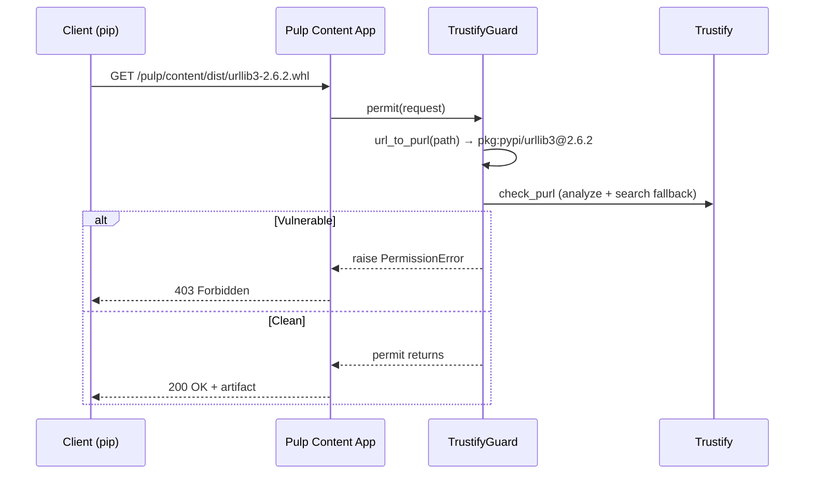

# Download Guard

A `ContentGuard` that blocks downloads of vulnerable packages at the Pulp Content App level. When attached to a distribution, every download request is checked against Trustify before the artifact is served.

The guard covers the **present** — it blocks vulnerable packages right now, as clients request them.

> The guard queries Trustify live at download time with the freshest advisory data. CVEs disclosed days or weeks after sync are caught without requiring a scan.

## How It Works



Requests for files that no PURL parser recognizes (e.g., `.rpm`, `.deb`, metadata files) are **silently allowed** — the guard only protects formats with a registered parser. Currently that means PyPI wheels, PyPI source distributions (`sdists`), and NPM tarballs (`.tgz`).

For the detection logic internals, see [Detection Pipeline](detection.md).

## Setup

### Create a Guard

There is no `pulp` CLI subcommand for TrustifyGuard — use `curl`:

```bash
# No CLI subcommand for contentguards/trustify/ — use curl
curl -X POST https://pulp.example.com/api/v3/contentguards/trustify/guard/ \
  -u admin:<password> -H "Content-Type: application/json" \
  -d '{"name": "trustify-guard"}'
```

### Attach to a Distribution (PyPI only)

```bash
pulp python distribution update \
  --name local-pypi \
  --content-guard /api/v3/contentguards/trustify/guard/<guard-uuid>/
```

> **Do not attach a guard to NPM distributions.** npm suppresses deprecation warnings when the tarball download is blocked by a guard — the developer sees a generic `403 Forbidden` with no Trustify URL. For NPM, rely on [deprecation warnings](deprecate.md) instead, which show actionable Trustify URLs in `npm install` output. The guard is designed for PyPI, where pip shows [yank warnings](yank.md) before attempting the download.

## Verify

```bash
# Download a vulnerable package (should return 403)
curl -o /dev/null -w "%{http_code}" \
  https://pulp.example.com/pulp/content/local-pypi/urllib3-2.6.2-py3-none-any.whl

# Download a fixed package (should return 200)
curl -o /dev/null -w "%{http_code}" \
  https://pulp.example.com/pulp/content/local-pypi/urllib3-2.7.0-py3-none-any.whl
```

## What the User Sees

When both [Yank Warnings](yank.md) and the download guard are active, pip first shows a yank warning with CVE details, then hits the 403 on download. See [Yank Interaction with Download Guard](yank.md#interaction-with-download-guard) for the full two-phase flow.

The guard's 403 response body includes Trustify URLs (visible via `curl`), but **npm does not display the response body** — it shows a generic `403 Forbidden`. This is why the guard should not be attached to NPM distributions: the deprecation warning (shown at the packument level) is the only way to surface Trustify URLs to npm users. See [NPM Deprecation](deprecate.md) for the recommended NPM protection strategy.

The enriched details appear in the content app logs (`kubectl logs deployment/pulp-content`):

```
pulp_trustify.gate: Blocking 'pkg:pypi/urllib3@2.6.2': CVE-2026-21441
Details:
  https://trustify.example.com/vulnerabilities/CVE-2026-21441
```

Enrichment is controlled by `TRUSTIFY_ENRICH_DETAILS` (default: `True`). See [Settings Reference](settings.md).

See [Known Limitations — Download Guard](known-limitations.md#download-guard) for caveats.