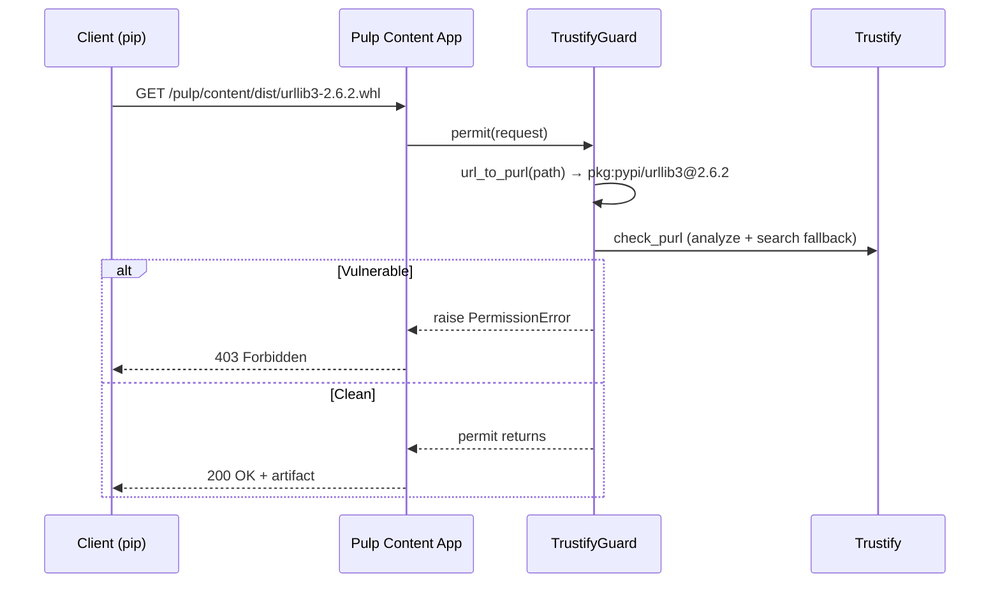

# Download Guard

A `ContentGuard` that blocks downloads of vulnerable packages at the Pulp Content App level. When attached to a distribution, every download request is checked against Trustify before the artifact is served.

## How It Works



For the detection logic internals, see [Detection Pipeline](detection.md).

## Setup

### Create a Guard

There is no `pulp` CLI subcommand for TrustifyGuard — use `curl`:

```bash
# No CLI subcommand for contentguards/trustify/ — use curl
curl -X POST https://pulp.example.com/api/v3/contentguards/trustify/guard/ \
  -u admin:<password> -H "Content-Type: application/json" \
  -d '{"name": "trustify-guard"}'
```

### Attach to a Distribution

```bash
pulp python distribution update \
  --name local-pypi \
  --content-guard /api/v3/contentguards/trustify/guard/<guard-uuid>/
```

## Verify

```bash
# Download a vulnerable package (should return 403)
curl -o /dev/null -w "%{http_code}" \
  https://pulp.example.com/pulp/content/local-pypi/urllib3-2.6.2-py3-none-any.whl

# Download a fixed package (should return 200)
curl -o /dev/null -w "%{http_code}" \
  https://pulp.example.com/pulp/content/local-pypi/urllib3-2.7.0-py3-none-any.whl
```

## Enriched Blocking Messages

When `TRUSTIFY_ENRICH_DETAILS` is enabled (default), content app logs include CVE IDs and Trustify URLs:

```
pulp_trustify.gate: Blocking 'pkg:pypi/urllib3@2.6.2': CVE-2026-21441
Details:
  https://trustify.example.com/vulnerabilities/CVE-2026-21441
```

See [Settings Reference](settings.md) for `TRUSTIFY_SEVERITY_THRESHOLD`, `TRUSTIFY_FAIL_OPEN`, and `TRUSTIFY_ENRICH_DETAILS`.

See [Known Limitations — Download Guard](known-limitations.md#download-guard) for caveats.