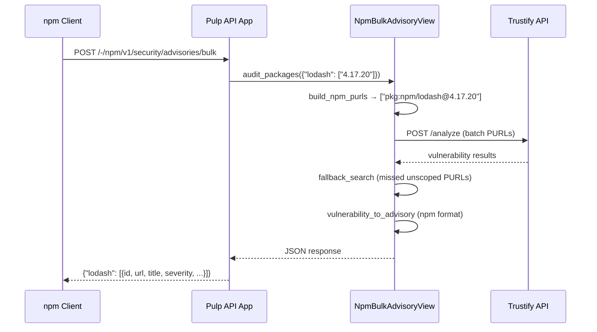

# NPM Audit Endpoint

REST endpoint that implements the npm registry `/-/npm/v1/security/advisories/bulk` protocol. NPM clients (`npm`, `yarn`, `pnpm`) POST package manifests to this endpoint during `npm audit` to retrieve vulnerability advisories in npm's expected JSON format.

## How It Works

When a client runs `npm audit`, it reads the lockfile (`package-lock.json`) and POSTs the installed package versions to the audit endpoint. The endpoint converts these to PURLs, queries Trustify live, and returns advisories in npm's advisory format.



### Request Format

The request body is a JSON object mapping package names to arrays of installed versions:

```json
{
  "lodash": ["4.17.20", "4.17.21"],
  "@angular/core": ["17.0.0"]
}
```

npm sends this payload gzip-compressed (`Content-Encoding: gzip`). The endpoint handles both compressed and uncompressed requests.

### Response Format

The response maps package names to arrays of advisory objects:

| Field | Type | Description |
|:------|:-----|:------------|
| `id` | `int` | Sequential advisory ID (unique within the response) |
| `url` | `string` | Trustify vulnerability URL |
| `title` | `string` | CVE identifier (e.g., `CVE-2024-1234`) |
| `severity` | `string` | `critical`, `high`, `moderate`, or `low` |
| `vulnerable_versions` | `string` | Exact version match (e.g., `=4.17.20`) |
| `cwe` | `array` | Empty list (CWE data not currently extracted) |
| `cvss` | `object` | `{"score": float}` — derived from severity |

Example response:

```json
{
  "lodash": [
    {
      "id": 1,
      "url": "https://trustify.example.com/vulnerabilities/CVE-2024-1234",
      "title": "CVE-2024-1234",
      "severity": "high",
      "vulnerable_versions": "=4.17.20",
      "cwe": [],
      "cvss": {"score": 7.0}
    }
  ]
}
```

## Endpoint

```
POST /pulp/api/v3/trustify/-/npm/v1/security/advisories/bulk
```

**Authentication:** None required — npm sends no auth headers for audit requests (`AllowAny` permission).

**Gzip support:** Handles `Content-Encoding: gzip` request bodies. Both compressed and decompressed payloads are limited to 10MB.

**Disabled behavior:** Returns `{}` (not 404) when disabled — returning 404 triggers npm's slower Quick Audit fallback.

## Configuration

| Setting | Default | Description |
|:--------|:--------|:------------|
| `TRUSTIFY_NPM_AUDIT_ENABLED` | `True` | Enable the audit endpoint. Returns `{}` when disabled. |
| `TRUSTIFY_URL` | `""` | Trustify API base URL. Endpoint returns `{}` when empty. |
| `TRUSTIFY_SEVERITY_THRESHOLD` | `"critical"` | Minimum severity to report. See [Severity Filtering](detection.md#severity-filtering). |
| `TRUSTIFY_FAIL_OPEN` | `False` | When `True`, return `{}` if Trustify is unreachable. When `False`, return `503`. |
| `TRUSTIFY_BATCH_SIZE` | `100` | Number of PURLs per `/analyze` batch. |

See [Settings Reference](settings.md#npm-protection) for the full configuration matrix.

## Usage

### npm audit

```bash
npm audit --registry https://pulp.example.com/pulp/api/v3/trustify/
```

### curl

```bash
curl -X POST \
  https://pulp.example.com/pulp/api/v3/trustify/-/npm/v1/security/advisories/bulk \
  -H "Content-Type: application/json" \
  -d '{"lodash": ["4.17.20"], "@angular/core": ["17.0.0"]}'
```

### nginx Proxy (Optional)

npm expects the audit endpoint at `/-/npm/v1/security/advisories/bulk` under the registry root. To avoid reconfiguring npm clients, proxy audit requests from the NPM distribution path to the Trustify endpoint:

```nginx
location ~ ^/pulp/content/my-npm-repo/-/npm/v1/security/advisories/bulk$ {
    proxy_pass https://pulp-api:8080/pulp/api/v3/trustify/-/npm/v1/security/advisories/bulk;
}
```

## Detection Flow

The audit endpoint uses the same two-phase detection logic as other protection layers:

1. **Analyze phase**: Batch query Trustify's `/analyze` endpoint with all PURLs.
2. **Search fallback**: For unscoped PURLs not found in analyze, query the `/search` endpoint with package name and version range patterns.

**Scoped packages** (`@scope/name`) skip the fallback phase — `fallback_search` uses `purl_package_name()` which strips scopes, leading to incorrect package name matching. Scoped packages rely solely on the analyze phase.

See [Detection Pipeline](detection.md) for the full analysis.

## Interaction with Other Layers

The audit endpoint is **read-only** and **advisory**. It does not block downloads or prevent installation — it only reports vulnerabilities. For enforcement, combine with other protection layers:

| Layer | Effect | Timing |
|:------|:-------|:-------|
| [NPM Deprecation](deprecate.md) | Warning on install | Packument request |
| [Download Guard](guard.md) | 403 on tarball | Tarball download |
| [Upload Gate](upload-gate.md) | Reject at upload | Sync/upload |
| NPM Audit | Report only | Audit request |

See [Known Limitations — NPM Audit](known-limitations.md#npm-audit) for caveats.
