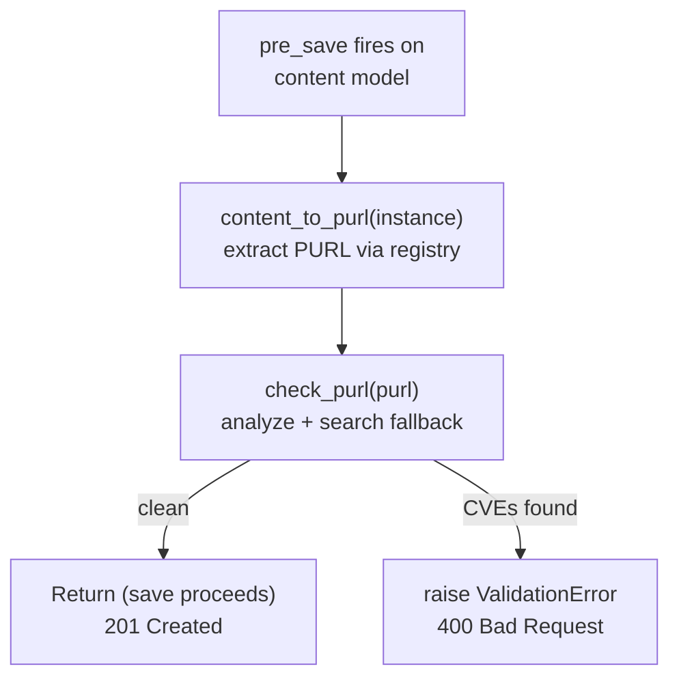
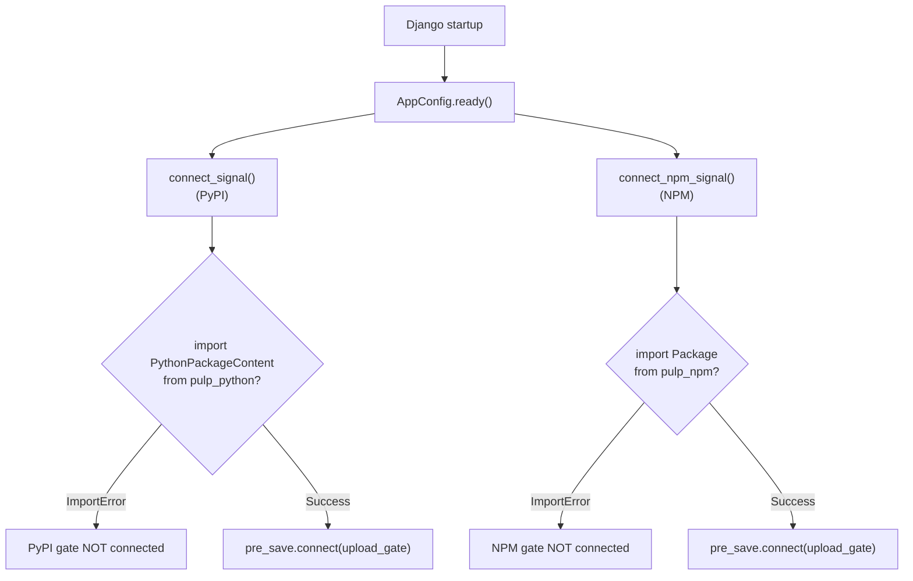

# Upload Gate

A Django `pre_save` signal handler that blocks uploads of vulnerable packages before they are persisted. Supports both Python packages (`PythonPackageContent`) and NPM packages (`Package`). The gate builds a PURL from the content metadata and checks it against Trustify.

The upload gate covers the **future**, it prevents new vulnerable packages from entering the repository.

> The gate blocks the entire sync when any package is vulnerable. This is strict by design — syncs fail entirely if any single package is vulnerable. Enable event-driven scanning (`TRUSTIFY_SCAN_ON_CONTENT_CHANGE=True`) as an alternative for selective post-sync remediation when sync availability is a priority.

## How It Works



For the detection logic internals, see [Detection Pipeline](detection.md).

## Signal Wiring

The upload gate connects at Django startup via `AppConfig.ready()`:



## Verify

Upload a vulnerable package (expect 400 with CVE IDs):

```bash
pulp python content create \
  --relative-path urllib3-2.6.2-py3-none-any.whl \
  --file urllib3-2.6.2-py3-none-any.whl \
  --repository local-pypi
```

Expected error:

```
Error: Task failed: Blocked due to CVE: CVE-2026-21441
Details:
  https://trustify.example.com/vulnerabilities/CVE-2026-21441
```

Enrichment is controlled by `TRUSTIFY_ENRICH_DETAILS` (default: `True`). See [Settings Reference](settings.md).

## Upload-Time Labeling

The upload gate annotates content with `trustify.*` labels during the `pre_save` check, providing the same metadata the scanner produces for periodic scans. Labels are written to `pulp_labels` regardless of whether the upload is allowed or blocked (though blocked uploads never reach the database).

Labels applied: `trustify.scanned`, `trustify.scanned_at`, `trustify.detected_by`, `trustify.cves`, `trustify.clean`.

### Label Semantics

| Label | Value | Meaning |
|:------|:------|:--------|
| `trustify.scanned` | `"true"` | Content was checked against Trustify |
| `trustify.scanned_at` | ISO 8601 timestamp | When the upload check occurred |
| `trustify.detected_by` | `"analyze"` or `"search"` | Detection mode used (see [Detection Pipeline](detection.md)) |
| `trustify.clean` | `"true"` | No CVEs found at any severity |
| `trustify.clean` | `"false"` | CVEs found (either above threshold → blocked, or below threshold → allowed) |
| `trustify.cves` | Space-separated CVE IDs | CVE identifiers for all findings |

### Three Outcomes

1. **Clean upload** — No CVEs at any severity. `trustify.clean=true`, upload proceeds.
2. **Below-threshold upload** — CVEs found but all below `TRUSTIFY_SEVERITY_THRESHOLD`. `trustify.clean=false`, `trustify.cves` populated, upload proceeds.
3. **Blocked upload** — One or more CVEs meet or exceed `TRUSTIFY_SEVERITY_THRESHOLD`. `trustify.clean=false`, `trustify.cves` populated, upload blocked with `ValidationError`.

### Query Labeled Content

```bash
# List all content scanned by the upload gate
pulp python content list --pulp-label-select "trustify.scanned=true"

# Find clean content (no CVEs at any severity)
pulp python content list --pulp-label-select "trustify.clean=true"

# Find allowed uploads with below-threshold CVEs
pulp python content list \
  --pulp-label-select "trustify.clean=false,trustify.scanned=true"

# Filter by specific CVE
pulp python content list --pulp-label-select "trustify.cves~CVE-2026-21441"

# Filter by detection mode
pulp python content list --pulp-label-select "trustify.detected_by=search"
```

**Note:** Blocked uploads never reach the database, so you cannot query them via labels. Blocked uploads are logged and visible in task error messages only.

Control labeling with `TRUSTIFY_GATE_LABEL_CONTENT` (default: `True`). See [Settings Reference](settings.md#upload-gate).

## Gate Advisory Records

The upload gate records a `GateAdvisory` for each allowed upload check (clean or below-threshold). This provides an audit trail of what was checked, when, and what CVEs were present at upload time.

Blocked uploads do not create `GateAdvisory` records — they are already captured in task error messages and logs.

### Advisory Schema

Each `GateAdvisory` includes:

| Field | Type | Description |
|:------|:-----|:------------|
| `purl` | String | Package URL that was checked |
| `cve_ids` | Array | All CVE IDs found (including below-threshold) |
| `details` | Array | Per-CVE enrichment (severity, Trustify URL, description) |
| `severity` | String | Threshold severity used for the check |
| `detection_mode` | String | `"analyze"` or `"search"` |
| `action` | String | Always `"allowed"` (blocked uploads don't create advisories) |
| `checked_at` | ISO 8601 | When the upload check occurred |

### Query Gate Advisories

The `GateAdvisory` endpoint is read-only and available at:

```
GET /pulp/api/v3/trustify/gate-advisories/
```

There is no `pulp` CLI subcommand, use `curl`:

```bash
# List all gate advisories
curl https://pulp.example.com/pulp/api/v3/trustify/gate-advisories/ \
  -u admin:<password>

# Query by PURL (URL-encode the PURL)
curl "https://pulp.example.com/pulp/api/v3/trustify/gate-advisories/?purl=pkg:pypi/urllib3@2.6.2" \
  -u admin:<password>
```

Example response:

```json
{
  "purl": "pkg:pypi/urllib3@2.6.2",
  "cve_ids": ["CVE-2026-21441"],
  "details": [
    {
      "cve_id": "CVE-2026-21441",
      "severity": "medium",
      "trustify_url": "https://trustify.example.com/vulnerabilities/CVE-2026-21441",
      "description": ""
    }
  ],
  "severity": "critical",
  "detection_mode": "analyze",
  "action": "allowed",
  "checked_at": "2026-06-08T14:32:10Z"
}
```

**Why this matters:** A package uploaded clean today may have CVEs disclosed tomorrow. Gate advisories record the upload-time state, distinct from scanner advisories that record periodic scan results.

Control advisory recording with `TRUSTIFY_GATE_ADVISORY` (default: `True`). See [Settings Reference](settings.md#upload-gate).

See [Known Limitations — Upload Gate](known-limitations.md#upload-gate) for caveats.
