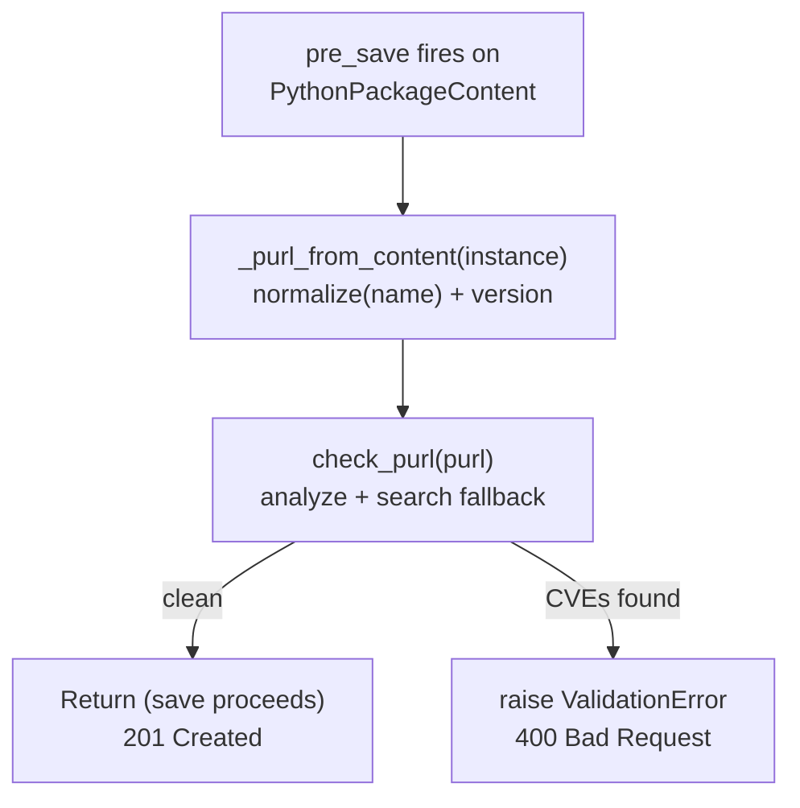
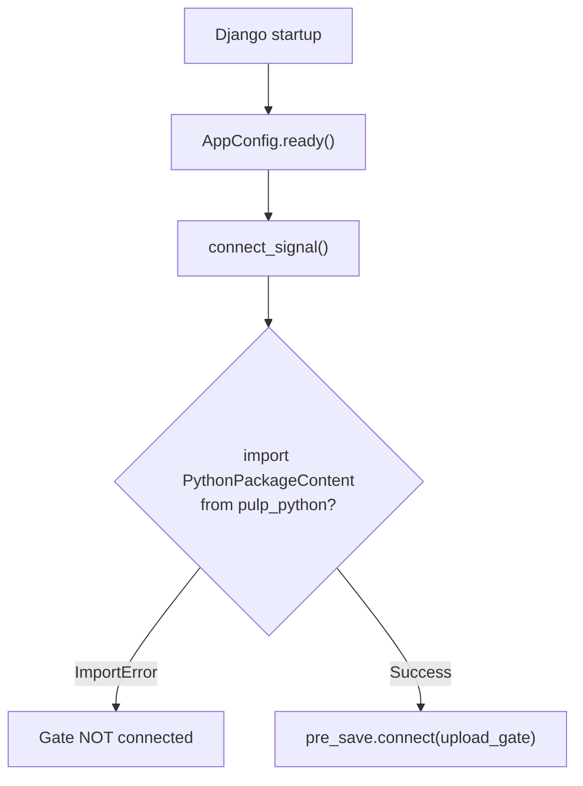

# Upload Gate

A Django `pre_save` signal handler that blocks uploads of vulnerable packages before they are persisted. When a client uploads a Python package, the gate builds a PURL from the content metadata and checks it against Trustify.

The upload gate covers the **future**, it prevents new vulnerable packages from entering the repository.

## How It Works



For the detection logic internals, see [Detection Pipeline](detection.md).

## Signal Wiring

The upload gate connects at Django startup via `AppConfig.ready()`:



## Verify

Upload a vulnerable package (expect 400 with CVE IDs):

```bash
pulp python content create \
  --relative-path urllib3-2.6.2-py3-none-any.whl \
  --file urllib3-2.6.2-py3-none-any.whl \
  --repository local-pypi
```

Expected error:

```
Error: Task failed: Blocked due to CVE: CVE-2026-21441
Details:
  https://trustify.example.com/vulnerabilities/CVE-2026-21441
```

Enrichment is controlled by `TRUSTIFY_ENRICH_DETAILS` (default: `True`). See [Settings Reference](settings.md).

See [Known Limitations — Upload Gate](known-limitations.md#upload-gate) for caveats.
