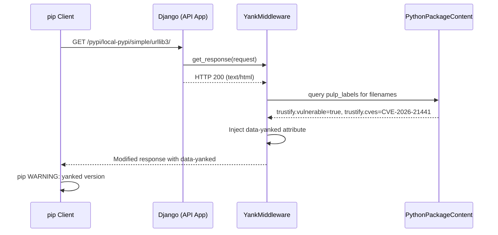
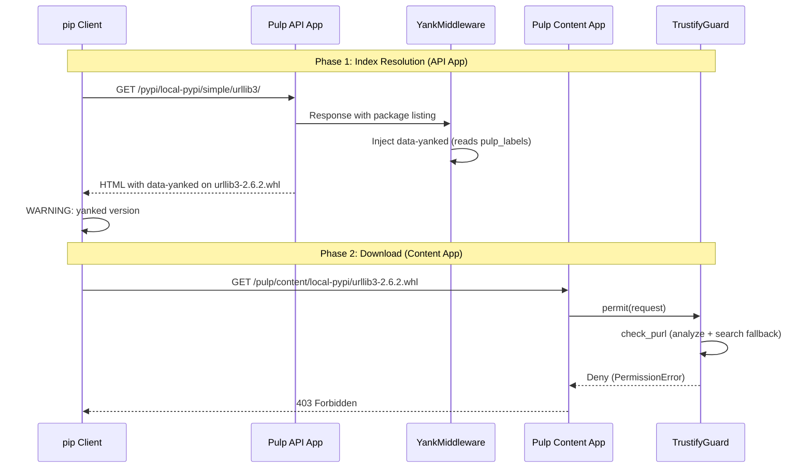

# Yank Warnings

Django middleware that injects [PEP 592](https://peps.python.org/pep-0592/) `data-yanked` attributes into Simple API responses for packages marked vulnerable by the scanner. Pip shows an inline warning with CVE details **before** the download guard's 403 response.

Yank warnings are advisory — for enforcement, use the [Download Guard](guard.md).

## How It Works

When a client queries the Simple API index (e.g., `GET /pypi/local-pypi/simple/urllib3/`), `YankMiddleware` intercepts the response and injects PEP 592 metadata for packages whose `pulp_labels` contain `trustify.vulnerable=true`.



### Guard Checks

The middleware skips processing when any of these conditions is false:

1. `pulp_python` is installed (`_available`)
2. `TRUSTIFY_YANK_VULNERABLE` is enabled
3. Request path contains `/simple/`
4. Response status is 200
5. Content-Type is `text/html` or `application/vnd.pypi.simple`

All checks are fail-safe: any exception during injection is caught and logged, returning the original response unmodified.

## Output Formats

### HTML

```html
<a href="..." data-yanked="Vulnerable package flagged by Trustify: https://trustify.example.com/vulnerabilities/CVE-2026-21441">
  urllib3-2.6.2-py3-none-any.whl
</a>
```

### JSON

```json
{
  "files": [
    {
      "filename": "urllib3-2.6.2-py3-none-any.whl",
      "yanked": "Vulnerable package flagged by Trustify: https://trustify.example.com/vulnerabilities/CVE-2026-21441"
    }
  ]
}
```

### pip Warning Output

```
WARNING: The candidate selected for download or install is a yanked version: 'urllib3'
  candidate (version 2.6.2 at .../urllib3-2.6.2.whl)
Reason for being yanked: Vulnerable package flagged by Trustify: https://trustify.example.com/vulnerabilities/CVE-2026-21441
```

`TRUSTIFY_YANK_MAX_CVES` (default: 3) limits the number of CVE URLs in the reason string.

## API App vs Content App URL

Yank warnings **only work with the API app URL**. The middleware runs in Django's request/response cycle, which the Content App (aiohttp) does not use.

```bash
# Correct (API app — dynamic simple index, yank warnings active)
pip install --index-url https://pulp.example.com/pypi/local-pypi/simple/ ...

# Wrong (content app — no middleware, no yank warnings)
pip install --index-url https://pulp.example.com/pulp/content/local-pypi/simple/ ...
```

## Interaction with Download Guard

When both yank warnings and download guard are active, they form a two-phase flow:



The warning gives context **before** the hard block.

### Verify

```bash
# Check HTML Simple API for data-yanked
curl -sSk 'https://pulp.example.com/pypi/local-pypi/simple/urllib3/'

# Check JSON Simple API
curl -sSk -H 'Accept: application/vnd.pypi.simple.v1+json' \
  'https://pulp.example.com/pypi/local-pypi/simple/urllib3/'
```

See [Known Limitations — Yank Warnings](known-limitations.md#yank-warnings) for caveats.