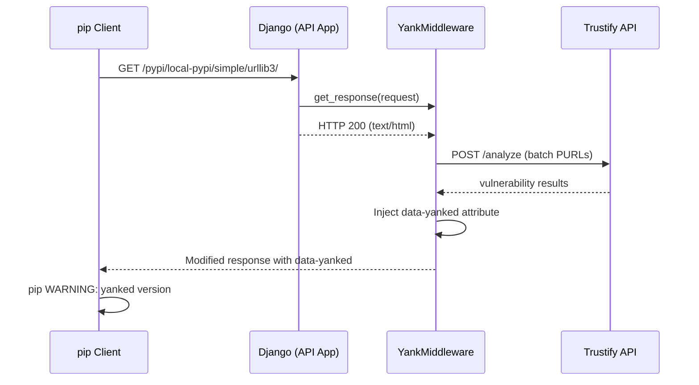

# Yank Warnings

Django middleware that injects [PEP 592](https://peps.python.org/pep-0592/) `data-yanked` attributes into Simple API responses for packages marked vulnerable by the scanner. Pip shows an inline warning with CVE details **before** the download guard's 403 response.

Yank warnings are advisory — for enforcement, use the [Download Guard](guard.md).

## How It Works

When a client queries the Simple API index (e.g., `GET /pypi/local-pypi/simple/urllib3/`), `YankMiddleware` intercepts the response and injects PEP 592 metadata for packages found vulnerable by querying Trustify live, with scanner labels as fallback.



### Guard Checks

The middleware skips processing when any of these conditions is false:

1. `pulp_python` is installed (`_available`)
2. `TRUSTIFY_YANK_VULNERABLE` is enabled
3. `TRUSTIFY_URL` is configured (falls back to scanner labels if empty)
4. Request path contains `/simple/`
5. Response status is 200
6. Content-Type is `text/html` or `application/vnd.pypi.simple`

All checks are fail-safe: any exception during injection is caught, logged at `ERROR` level, and the original response is returned unmodified. The middleware never blocks a Simple API response, it only adds metadata.

## How Yanked Works

[PEP 592](https://peps.python.org/pep-0592/) defines a mechanism for package indexes to mark specific releases as "yanked" — meaning the release exists but should be avoided. A yanked release includes a reason string that the package manager displays as a warning. The client still allows installation of yanked versions when the user pins an exact version (e.g., `urllib3==2.6.2`), but warns prominently before proceeding.

`pulp_trustify` uses this mechanism to surface vulnerability information directly in the package manager workflow. The scanner labels vulnerable packages, and the middleware translates those labels into PEP 592 `data-yanked` attributes with Trustify CVE URLs as the reason.

## PyPI (`pip`)

```
$ pip install \
    --quiet \
    --no-deps \
    --index-url "https://pulp.example.com/pypi/local-pypi/simple/" \
    urllib3==2.6.2
WARNING: The candidate selected for download or install is a yanked version: 'urllib3' candidate (version 2.6.2 at https://pulp.example.com/pulp/content/local-pypi/urllib3-2.6.2-py3-none-any.whl#sha256=ec21cd... (from https://pulp.example.com/pypi/local-pypi/simple/urllib3/) (requires-python:>=3.9))
Reason for being yanked: Vulnerable package flagged by Trustify:
- https://trustify.example.com/vulnerabilities/CVE-2026-21441
- https://trustify.example.com/vulnerabilities/CVE-2026-44432
- https://trustify.example.com/vulnerabilities/CVE-2026-44431
```

`TRUSTIFY_YANK_MAX_CVES` (default: 3) limits the number of CVE URLs in the reason string.

## Pulp CLI

Check whether yank metadata is present in the Simple API response:

```bash
# HTML format (default) — look for data-yanked attribute
curl -sSk 'https://pulp.example.com/pypi/local-pypi/simple/urllib3/'

# JSON format (PEP 691) — look for "yanked" field
curl -sSk -H 'Accept: application/vnd.pypi.simple.v1+json' \
  'https://pulp.example.com/pypi/local-pypi/simple/urllib3/'
```

The middleware handles both [PEP 592](https://peps.python.org/pep-0592/) HTML (`data-yanked` attribute) and [PEP 691](https://peps.python.org/pep-0691/) JSON (`"yanked"` field) response formats.

## API App vs Content App URL

Yank warnings **only work with the API app URL**. The middleware runs in Django's request/response cycle, which the Content App (aiohttp) does not use.

```bash
# Correct (API app — dynamic simple index, yank warnings active)
pip install --index-url https://pulp.example.com/pypi/local-pypi/simple/ ...

# Wrong (content app — no middleware, no yank warnings)
pip install --index-url https://pulp.example.com/pulp/content/local-pypi/simple/ ...
```

## Interaction with Download Guard

When both yank warnings and download guard are active, they form a two-phase flow:


The warning gives context **before** the hard block.

See [Known Limitations — Yank Warnings](known-limitations.md#yank-warnings) for caveats.
