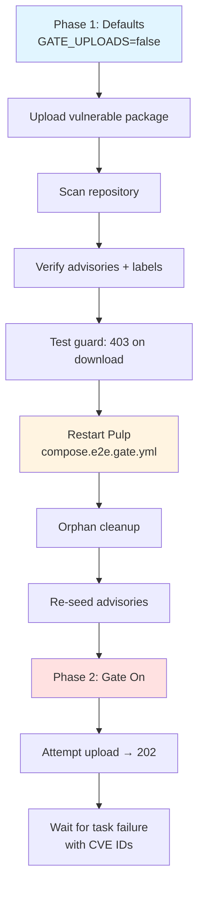

# E2E Testing Guide

End-to-end testing for `pulp_trustify` requires live infrastructure (PostgreSQL + Trustify + Pulp) orchestrated via Docker/Podman Compose. This document explains the testing strategy, how to run tests locally, and why the plugin uses a two-phase approach.

## The Testing Deadlock Problem

The plugin implements four protection layers that conflict during testing:

1. **Upload Gate** (`GATE_UPLOADS`): Blocks vulnerable packages at upload time via `pre_save` signal. If enabled, vulnerable content never enters the repository — nothing to scan, guard, or yank.

2. **Scanner** (`SCAN_REMOVE_CONTENT`): Removes vulnerable content after scanning. If enabled, content disappears before the download guard can be tested.

3. **Download Guard**: Blocks downloads of vulnerable packages via `ContentGuard.permit()`. Needs vulnerable content already in the repository to test.

4. **Yank Warnings** (`YANK_VULNERABLE`): Injects PEP 592 `data-yanked` into Simple API. Can interfere with guard testing.

**The deadlock:** Gate blocks uploads → no content → scanner/guard/yank untestable. Remove-on-scan deletes content → guard untestable.

**Solution:** Default settings are "observe only" mode. Testing happens in two phases with different configurations.

## Two-Phase Testing Strategy

Django settings are loaded once at startup, so Pulp must be restarted to change the gate configuration.

### Phase 1: Observe Only (compose overrides)

**Configuration** (set in `compose.e2e.yml`):
- `GATE_UPLOADS = false` — uploads allowed
- `SCAN_REMOVE_CONTENT = false` — content stays after scan
- `YANK_VULNERABLE = false` — no yank interference

**Tests:**
1. Upload vulnerable package (urllib3-2.6.2 wheel)
2. Scan repository → verify task completion
3. Check advisory records created
4. Verify `trustify.*` labels on content
5. Download attempt → verify 403 from guard

Content remains in repository throughout all tests.

### Phase 2: Gate Enabled (restart required)

**Configuration:**
- Stop Pulp + runner containers
- Recreate with [`compose.e2e.gate.yml`](compose.e2e.gate.yml) override (sets `GATE_UPLOADS = True`)
- Run orphan cleanup (removes content from phase 1 so `pre_save` fires on fresh upload)
- Re-seed advisories (Trustify data may be lost during container recreation)

**Tests:**
1. Attempt upload of vulnerable package
2. Verify HTTP 202 Accepted (upload is async)
3. Wait for task — verify it fails with CVE IDs in the error description

> **Note:** Pulp uploads are asynchronous. The POST returns 202 with a task href. The gate's `pre_save` signal fires inside the Pulp worker when the task executes. If the gate blocks, the *task* fails — not the HTTP request.



## Running Tests Locally

### Prerequisites

- Docker or Podman with compose plugin
- Python 3.11+ with dev dependencies installed

```bash
source .venv/bin/activate
pip install -e '.[dev]'
```

### Full Two-Phase Pipeline

The `poe e2e` task orchestrates the complete test lifecycle:

```bash
poe e2e
```

This runs:
1. `e2e-up`: builds images, starts compose stack, seeds OSV advisories
2. `test-e2e`: phase 1 tests (status, scan, guard) — 12 tests
3. `e2e-restart-pulp`: recreates Pulp with gate override, orphan cleanup, re-seed
4. `test-e2e-gate`: phase 2 tests (upload gate) — 1 test
5. `e2e-down`: tears down stack and volumes

**For Docker users (CI default):**

```bash
COMPOSE="docker compose" poe e2e
```

### Key Files

| File | Purpose |
|:-----|:--------|
| [`workflow.py`](workflow.py) | Orchestrator with subcommands: up, down, restart-pulp, seed, cleanup, status |
| [`compose.e2e.yml`](compose.e2e.yml) | Base compose stack (PostgreSQL, Trustify, Pulp, runner) |
| [`compose.e2e.gate.yml`](compose.e2e.gate.yml) | Override that sets `GATE_UPLOADS=True` for phase 2 |
| [`e2e/conftest.py`](e2e/conftest.py) | E2E fixtures (repository + TrustifyGuard + distribution) |
| [`e2e/fixtures/`](e2e/fixtures/) | PYSEC advisory JSONs and test wheel |
| [`conftest.py`](conftest.py) | Shared fixtures (PulpAPI, wait_for_task, upload_package) |

### Manual Infrastructure Control

Start and keep infrastructure running for iterative testing:

```bash
# Start infrastructure
poe e2e-up

# Run phase 1 tests (can rerun multiple times)
poe test-e2e

# Restart Pulp with gate enabled
poe e2e-restart-pulp

# Run phase 2 tests
poe test-e2e-gate

# Tear down when finished
poe e2e-down
```

### Check Infrastructure Status

```bash
python tests/workflow.py status
```

Expected output:

```
==> Checking service health
    Trustify     OK
    Pulp         OK
```

### Seed Test Data

Test advisories are OSV-format JSON files (`PYSEC-*.json`) in `tests/e2e/fixtures/`. They are seeded automatically during `e2e-up` via Trustify's `/api/v2/advisory?format=osv` endpoint. To manually reseed:

```bash
python tests/workflow.py seed
```

The curated advisories cover `urllib3` CVEs for deterministic test results. The `requests` package is intentionally absent — tests rely on it being clean.

## Test Organization

Tests are organized by feature using pytest markers registered in `pyproject.toml`: `e2e` (base marker), `status` (plugin registration), `scan` (scanner behavior), `guard` (download blocking), and `gate` (upload blocking). Phase 1 tests run with the default observe-only configuration and exercise status, scan, and guard features. Phase 2 tests run after restarting Pulp with gating enabled and verify upload rejection.

Tests live in `tests/e2e/` for infrastructure-level scenarios and co-located with source code (Go-style) for component-level scenarios. All E2E tests require live Pulp and Trustify services.

### Shared Fixtures

The test suite provides reusable fixtures for common operations:

- **Connection fixtures** (`trustify_client`, `pulp_api`): Pre-configured clients for Trustify and Pulp APIs with auth
- **Task helpers** (`wait_for_task`, `upload_package`): Reusable callables for async task polling and package uploads
- **Repository fixtures** (`python_repository`, `uploaded_vulnerable`): Auto-cleanup test data with TrustifyGuard attached to the distribution and urllib3-2.6.2 wheel as deterministic vulnerable package

See `pyproject.toml` and `tests/e2e/conftest.py` for fixture implementation details.

## Environment Variables

Set via poe tasks in `pyproject.toml` (can override via `.env` or shell):

| Variable | Default | Description |
|:---------|:--------|:------------|
| `COMPOSE` | `podman compose` | Compose command (`docker compose` on CI) |
| `TRUSTIFY_URL` | `http://localhost:9010` | Trustify base URL |
| `PULP_URL` | `http://localhost:8080` | Pulp base URL |
| `PULP_API_ROOT` | `/pulp/` | Pulp API root prefix |
| `PULP_USERNAME` | `admin` | Pulp admin username |
| `PULP_PASSWORD` | `password` | Pulp admin password |
| `PULP_VERIFY_SSL` | `false` | Verify TLS certificates |

## Poe Task Reference

See [CONTRIBUTING.md](../CONTRIBUTING.md) for the complete task table. E2E-specific tasks:

- `poe e2e` — full two-phase pipeline
- `poe e2e-up` — start infrastructure
- `poe e2e-down` — stop and remove infrastructure
- `poe e2e-restart-pulp` — restart Pulp with gate enabled
- `poe test-e2e` — phase 1 tests (status, scan, guard)
- `poe test-e2e-gate` — phase 2 tests (gate)
